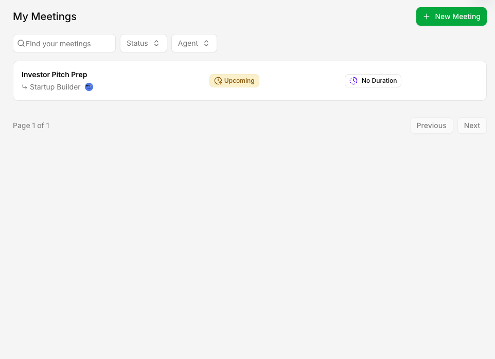
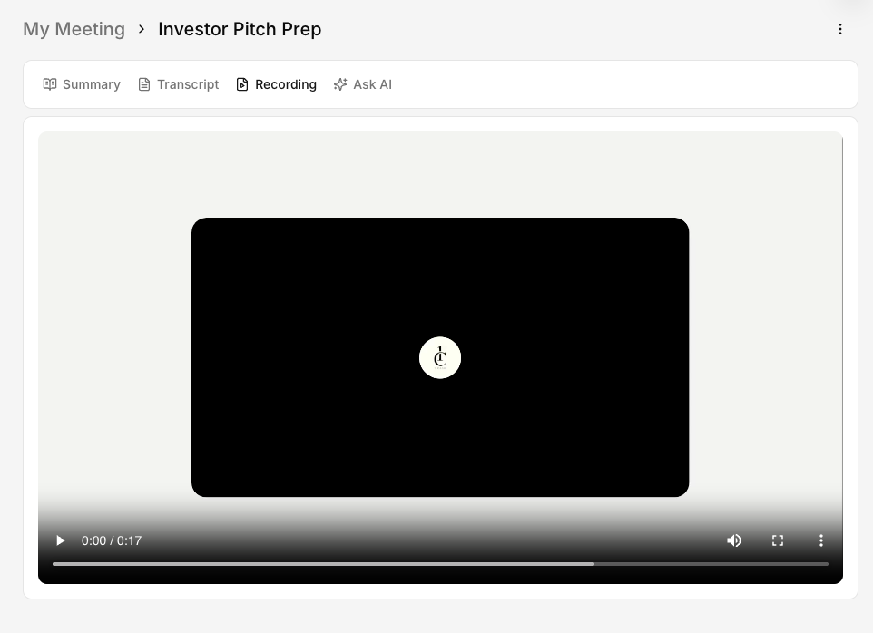
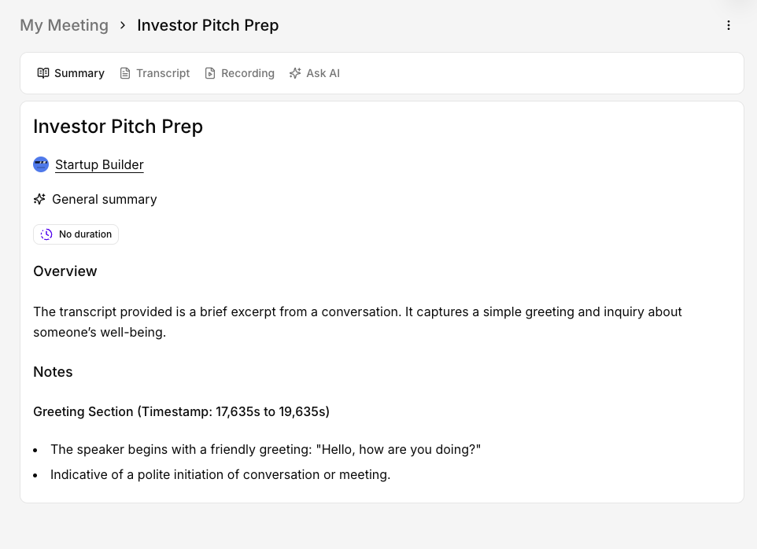
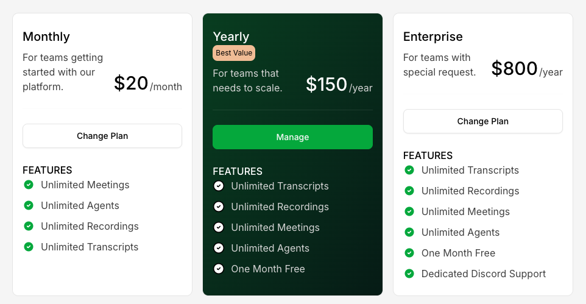

<h1 align="center">
  <br/>
  CallSage
</h1>

<p align="center">
  <strong>Real-time video meetings with AI agents that listen, assist, and summarize — automatically.</strong><br/>
  A production-grade SaaS built end-to-end: from live video to async AI pipelines to freemium billing.
</p>

<p align="center">
  <a href="https://callsage-com-8m9w.vercel.app/" target="_blank"><strong>🚀 Live Demo →</strong></a> &nbsp;·&nbsp;
  <a href="#getting-started">Run Locally</a> &nbsp;·&nbsp;
  <a href="#architecture">Architecture</a>
</p>

<p align="center">
  
  
  
  
  
  
  
  
  
</p>

---

## What Is CallSage?

CallSage is a **meeting intelligence platform** where you configure custom AI agents, schedule video calls, and have those agents join the call live — answering questions, keeping notes, and guiding the agenda in real time. When the call ends, an async AI pipeline automatically generates a full transcript, a structured summary, and an interactive chat so you can query the conversation like a knowledge base.

**The problem it solves:** Most teams spend hours writing meeting notes, lose context between calls, and have no way to query what was said. CallSage replaces that entirely — every meeting becomes searchable, summarised, and actionable without any manual effort.

---

## Product Outcomes

| Before CallSage | After CallSage |
|---|---|
| Manual note-taking during calls | AI agent joins and captures everything live |
| Scattered follow-up emails | Structured summary delivered automatically after the call |
| "Who said what?" confusion | Full searchable transcript with speaker labels |
| No way to revisit a decision | Ask the AI chat: *"What did we decide about X?"* |
| Inconsistent agent behaviour | Configurable system prompts per agent, reproducible every time |

---

## Screenshots

| Dashboard & Meetings | Live AI Agent on Call |
|---|---|
|  |  |

| AI Summary & Transcript | Pricing & Upgrade |
|---|---|
|  |  |

> **Full walkthrough:** [Watch the demo video](public/CallSage.MP4)

---

## Features

### For Users
- **Custom AI Agents** — Configure agents with unique names, avatars, and system-prompt instructions. Each agent is purpose-built (sales rep, coach, interviewer, etc.).
- **Live Video Meetings** — Powered by Stream Video SDK with lobby, controls, and recording.
- **Real-time AI Participation** — Agents join the call, listen, and respond via OpenAI's Realtime API.
- **Auto Transcript** — Every call produces a speaker-labeled JSONL transcript stored on Stream.
- **AI-Generated Summary** — GPT-4o processes the transcript into a structured markdown summary: an Overview narrative + timestamped Notes sections.
- **Ask AI (Post-call Chat)** — Query the meeting like a knowledge base via Stream Chat, scoped to that specific meeting.
- **Recording Playback** — Full video recording with in-browser player.
- **Meeting Status Tracking** — Lifecycle states: `upcoming → active → processing → completed / cancelled`.
- **Freemium Model** — 3 free meetings + 3 free agents. Upgrade via Polar for unlimited access.

### For Developers / Recruiters Reading the Code
- End-to-end type safety from database → server → client with **tRPC + Drizzle ORM + Zod**
- **Middleware-based access control** — `protectedProcedure` for auth, `premiumProcedure` for usage-gate enforcement
- **Async background jobs** with Inngest — transcript fetch → parse → speaker enrichment → GPT-4o summarisation → DB write, all in a durable, retryable pipeline
- **OAuth2 social login** (GitHub + Google) via Better Auth
- URL-synced filters and pagination with **nuqs** (no prop-drilling, shareable URLs)
- Feature-based module architecture (`agents/`, `meetings/`, `call/`, `premium/`, `dashboard/`)

---

## Tech Stack

| Layer | Technology |
|---|---|
| **Framework** | Next.js 15 (App Router) |
| **Language** | TypeScript 5 |
| **Styling** | Tailwind CSS v4, shadcn/ui, Radix UI |
| **API** | tRPC v11 + TanStack Query v5 |
| **Database** | Neon (serverless PostgreSQL) |
| **ORM** | Drizzle ORM |
| **Auth** | Better Auth (GitHub + Google OAuth) |
| **Video** | Stream Video React SDK |
| **Chat** | Stream Chat React SDK |
| **AI Model** | OpenAI GPT-4o (via Inngest Agent Kit) |
| **Background Jobs** | Inngest |
| **Billing** | Polar.sh |
| **Deployment** | Vercel |

---

## Architecture

```
┌─────────────────────────────────────────────────────────────────┐
│                         Browser (React 19)                       │
│  Next.js App Router · tRPC Client · TanStack Query · Stream SDK  │
└───────────────────────────┬─────────────────────────────────────┘
                            │ HTTPS / WebSocket
┌───────────────────────────▼─────────────────────────────────────┐
│                     Next.js Server (Vercel)                       │
│  tRPC Routers → Drizzle ORM → Neon PostgreSQL                    │
│  Better Auth → Session management                                │
│  Polar middleware → Premium gate enforcement                     │
└──────┬─────────────────────────────────────┬────────────────────┘
       │ Stream Video/Chat                   │ Inngest event
┌──────▼────────────┐               ┌────────▼────────────────────┐
│  Stream Platform   │               │       Inngest Pipeline       │
│  - Video call      │               │  1. Fetch transcript (JSONL) │
│  - Live AI agent   │  call ended → │  2. Parse + enrich speakers  │
│  - Recording       │  webhook      │  3. Run GPT-4o summarizer    │
│  - Transcript URL  │               │  4. Write summary to DB      │
└───────────────────┘               └─────────────────────────────┘
```

### Directory Structure

```
src/
├── app/                        # Next.js App Router
│   ├── (auth)/                 # Sign-in / sign-up pages
│   ├── (dashboard)/            # Authenticated dashboard shell
│   │   ├── agents/             # Agent list + detail pages
│   │   ├── meetings/           # Meeting list + detail pages
│   │   └── upgrade/            # Pricing / upgrade page
│   ├── call/[meetingId]/       # Live call room (no sidebar)
│   └── api/
│       ├── auth/               # Better Auth API handler
│       ├── inngest/            # Inngest function endpoint
│       ├── trpc/               # tRPC HTTP handler
│       └── webhook/            # Stream webhook (call ended)
├── modules/                    # Feature modules (server + UI)
│   ├── agents/                 # CRUD, schemas, tRPC router
│   ├── meetings/               # CRUD, schemas, tRPC router
│   ├── call/                   # Live call UI components
│   ├── dashboard/              # Sidebar, navbar, command palette
│   └── premium/                # Billing, usage limits, Polar
├── ingest/                     # Inngest client + background functions
├── db/                         # Drizzle schema + Neon client
├── trpc/                       # tRPC init, routers, context
└── lib/                        # Auth client, Stream clients, Polar client
```

### Database Schema

```
users          — id, name, email, image (Better Auth managed)
sessions       — id, userId, token, expiresAt
accounts       — OAuth provider records
agents         — id, userId, name, instructions (system prompt)
meetings       — id, userId, agentId, status, transcriptUrl,
                 recordingUrl, summary, startedAt, endedAt
```

Meeting `status` enum: `upcoming | active | processing | completed | cancelled`

---

## Getting Started

### Prerequisites

- Node.js 18.17+
- A [Neon](https://neon.tech) database (free tier works)
- A [Stream](https://getstream.io) account (Video + Chat)
- An [OpenAI](https://platform.openai.com) API key
- A [Polar.sh](https://polar.sh) account for billing
- A [Inngest](https://inngest.com) account (or run locally with `npx inngest-cli dev`)
- GitHub and/or Google OAuth app credentials

### 1. Clone & Install

```bash
git clone https://github.com/abd-az1z/callsage.com.git
cd callsage.com
npm install
```

### 2. Environment Variables

Copy the example file and fill in your values:

```bash
cp .evn.example .env
```

| Variable | Description |
|---|---|
| `DATABASE_URL` | Neon PostgreSQL connection string |
| `BETTER_AUTH_SECRET` | Random secret for session signing (`openssl rand -base64 32`) |
| `BETTER_AUTH_URL` | App URL, e.g. `http://localhost:3000` |
| `NEXT_PUBLIC_APP_URL` | Same as above (public) |
| `GITHUB_CLIENT_ID` | GitHub OAuth App client ID |
| `GITHUB_CLIENT_SECRET` | GitHub OAuth App client secret |
| `GOOGLE_CLIENT_ID` | Google Cloud OAuth client ID |
| `GOOGLE_CLIENT_SECRET` | Google Cloud OAuth client secret |
| `NEXT_PUBLIC_STREAM_VIDEO_API_KEY` | Stream Video public key |
| `STREAM_VIDEO_SECRET_KEY` | Stream Video secret |
| `NEXT_PUBLIC_STREAM_CHAT_API_KEY` | Stream Chat public key |
| `STREAM_CHAT_SECRET_KEY` | Stream Chat secret |
| `OPENAI_API_KEY` | OpenAI API key (GPT-4o) |
| `POLAR_ACCESS_TOKEN` | Polar.sh access token for billing |
| `INNGEST_DISABLE_OTEL` | Set to `1` to disable OpenTelemetry in dev |

### 3. Push the Database Schema

```bash
npm run db:push
```

This uses Drizzle Kit to push the schema to your Neon database. No migration files needed.

### 4. Run the Dev Server

```bash
npm run dev
```

Open [http://localhost:3000](http://localhost:3000).

To test Inngest background jobs locally:

```bash
# In a second terminal — starts the Inngest dev server
npx inngest-cli@latest dev
```

To test Stream webhooks (call-ended events) locally:

```bash
# Requires an ngrok account with a static URL configured
npm run dev:webhook
```

---

## Available Scripts

| Command | Description |
|---|---|
| `npm run dev` | Start Next.js dev server |
| `npm run build` | Production build |
| `npm run start` | Start production server |
| `npm run lint` | ESLint |
| `npm run db:push` | Push Drizzle schema to Neon |
| `npm run db:studio` | Open Drizzle Studio (visual DB browser) |
| `npm run dev:webhook` | Expose local server via ngrok for Stream webhooks |

---

## How the AI Pipeline Works

1. **User starts a meeting** → tRPC creates a meeting record (`status: upcoming`) and a Stream Video call.
2. **Agent joins** → Inngest Agent Kit connects the configured agent to the call via OpenAI Realtime API.
3. **Call ends** → Stream fires a webhook to `/api/webhook`.
4. **Webhook handler** → Updates the meeting (`status: processing`, saves `transcriptUrl` and `recordingUrl`), then fires an Inngest event `meetings/processing`.
5. **Inngest function runs** (durable, retryable):
   - **Step 1:** Fetch the JSONL transcript from Stream's CDN.
   - **Step 2:** Parse transcript items.
   - **Step 3:** Enrich each line with speaker names (join against `users` + `agents` tables).
   - **Step 4:** Run GPT-4o summarizer agent — produces an `### Overview` + `### Notes` markdown document.
   - **Step 5:** Write the summary to the `meetings` table, set `status: completed`.
6. **User opens meeting detail** → Sees Summary, Transcript, Recording, and Ask AI tabs.

---

## Freemium & Billing

Free users can create up to **3 agents** and run **3 meetings**. Every tRPC mutation that creates an agent or meeting goes through `premiumProcedure`, which checks the user's Polar subscription status before allowing the operation. Upgrade redirects to a Polar-hosted checkout flow.

---

## Deployment

The project is optimised for **Vercel**:

1. Import the repository in Vercel.
2. Add all environment variables from the table above.
3. Set the build command to `npm run build` and output to `.next`.
4. Deploy — Vercel handles serverless functions, edge middleware, and static assets automatically.

For the Inngest background pipeline, register the app URL (`/api/inngest`) in your Inngest dashboard so it can invoke functions in production.

---

## What I Learned / Demonstrated

This project was designed to showcase a complete, production-minded engineering workflow:

- **Product thinking:** Designed around a real user problem (wasted meeting time), with a clear freemium model and obvious upgrade path.
- **Full-stack architecture:** End-to-end type safety with tRPC + Zod + Drizzle — no `any` types crossing the API boundary.
- **Async AI pipelines:** Inngest's step functions make the post-call processing observable, retryable, and easy to extend.
- **Real-time systems:** Integrating Stream's Video and Chat SDKs required understanding WebRTC, token-based auth, and event-driven webhooks.
- **Access control patterns:** Middleware-composed tRPC procedures cleanly separate auth from business logic from usage gating.
- **Serverless-first:** Neon's serverless Postgres driver, Vercel Edge, and Inngest all designed to scale to zero and burst on demand.

---

## License

MIT — see [LICENSE](LICENSE).

---

<p align="center">
  Built by <a href="https://github.com/abd-az1z">Abdulaziz</a> · 
  <a href="https://github.com/abd-az1z/callsage.com/issues">Issues</a> · 
  mohdabdulaziz2023@gmail.com
</p>
